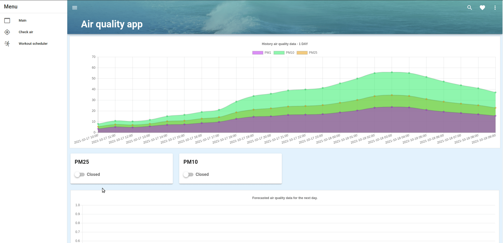

# Air_quality_app_v2
Web application with Vue frontend and FastAPI (Python) backend.

It monitors air quality and pollution in every place in the world thanks to **Airly API**.

It has main dashboard, in a detailed view you can see information as charts and forecast data.

And standard factor specified for air pollution for current location.

Check air tab and Workout scheduler is on going...
Workout scheduler - hit the 'cleanest' timeslot for the outdoor workout ( it you are a sport freak like me
it might be quite usefull :)).





## How to run project


**Clone the code**

Obtain the url to your git repository.

```
git clone https://github.com/CodingBee77/Python_projects.git
```

### Use Docker

After cloning the repo, go to the app directory with the Dockerfile and:

```
 docker-compose up --build
```

After a few seconds, open your web browser to http://localhost:8080/
You should see our app!

To fetch Swagger UI for API documentation. go to: http://localhost:5000/


## Contributing
Pull requests are welcome. For major changes, please open an issue first to discuss what you would like to change.


## License
[GNU](https://www.gnu.org/licenses/gpl-3.0.html)


